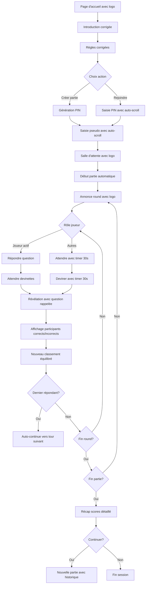

# Document 2/7 : Design System et Expérience Utilisateur - Projet Epercept

## Scope de ce document
Ce document définit l'interface utilisateur, le design system, les parcours utilisateur et toutes les spécifications visuelles nécessaires pour développer l'application Epercept. Il couvre le COMMENT l'utilisateur interagit avec l'application visuellement.

## Autres documents du projet
- Document 1/7 : Spécifications Fonctionnelles et Règles Métier ✓
- Document 3/7 : Architecture Backend
- Document 4/7 : Architecture Frontend
- Document 5/7 : Sécurité, Tests et DevOps
- Document 6/7 : Performance et Scalabilité
- Document 7/7 : Administration et Configuration

---

## 1. Customer Journey - Parcours utilisateur complet

### 1.1 Flow principal (mermaid)



### 1.2 Points d'interaction critiques
- **Auto-scroll mobile** : Sur tous les champs de saisie
- **Logo Percept** : Présent sur tous les écrans
- **Timer visuel** : Compte à rebours animé pour les 30 secondes
- **Feedback immédiat** : Toute action doit avoir un retour visuel < 200ms
- **Transitions fluides** : Entre tous les états de jeu

## 2. Design System

### 2.1 Palette de couleurs

```css
:root {
  /* Couleurs principales */
  --primary: #6366F1;      /* Indigo moderne - CTAs principaux */
  --secondary: #EC4899;    /* Rose accent - Éléments secondaires */
  --success: #10B981;      /* Vert validation - Bonnes réponses */
  --error: #EF4444;        /* Rouge erreur - Mauvaises réponses */
  
  /* Thèmes par round (backgrounds gradients) */
  --personality: #8B5CF6;   /* Violet - Round 1 */
  --situations: #3B82F6;    /* Bleu - Round 2 */
  --representations: #F59E0B; /* Orange - Round 3 */
  --relations: #EF4444;     /* Rouge - Round 4 */
  
  /* Neutres */
  --background: #0F172A;    /* Fond sombre principal */
  --surface: #1E293B;       /* Cartes et surfaces */
  --text: #F8FAFC;          /* Texte principal blanc */
  --text-muted: #94A3B8;    /* Texte secondaire grisé */
  
  /* États spéciaux */
  --disabled: #475569;      /* Éléments désactivés */
  --overlay: rgba(0,0,0,0.5); /* Overlays modaux */
}
```

### 2.2 Typographie

```css
/* Font principale */
@import url('https://fonts.googleapis.com/css2?family=Belanosima:wght@400;600;700&display=swap');

/* Échelle typographique */
--text-xs: 0.75rem;    /* 12px - Mentions légales */
--text-sm: 0.875rem;   /* 14px - Labels, aide */
--text-base: 1rem;     /* 16px - Corps de texte */
--text-lg: 1.125rem;   /* 18px - Sous-titres */
--text-xl: 1.25rem;    /* 20px - Titres sections */
--text-2xl: 1.5rem;    /* 24px - Titres principaux */
--text-3xl: 1.875rem;  /* 30px - Headers */
--text-4xl: 2.25rem;   /* 36px - Titres écrans */
--text-5xl: 3rem;      /* 48px - Logo texte */

/* Poids */
--font-normal: 400;
--font-semibold: 600;
--font-bold: 700;
```

### 2.3 Spacing et Grid

```css
/* Système de spacing (multiples de 4px) */
--space-1: 0.25rem;  /* 4px */
--space-2: 0.5rem;   /* 8px */
--space-3: 0.75rem;  /* 12px */
--space-4: 1rem;     /* 16px */
--space-5: 1.25rem;  /* 20px */
--space-6: 1.5rem;   /* 24px */
--space-8: 2rem;     /* 32px */
--space-10: 2.5rem;  /* 40px */
--space-12: 3rem;    /* 48px */
--space-16: 4rem;    /* 64px */

/* Container */
--container-max: 650px; /* Largeur max desktop */
--container-padding: var(--space-5); /* Padding latéral */
```

### 2.4 Composants UI

#### Boutons
```css
.button {
  /* Base */
  font-family: 'Belanosima', sans-serif;
  font-weight: 600;
  font-size: var(--text-xl);
  padding: var(--space-4) var(--space-6);
  border-radius: 10px;
  transition: all 0.2s ease;
  cursor: pointer;
  width: 100%;
  
  /* États */
  &:hover { transform: translateY(-2px); box-shadow: 0 4px 12px rgba(0,0,0,0.15); }
  &:active { transform: translateY(0); }
  &:disabled { opacity: 0.5; cursor: not-allowed; }
}

/* Variantes */
.button-primary {
  background: var(--primary);
  color: white;
}

.button-secondary {
  background: white;
  color: var(--primary);
}

.button-ghost {
  background: transparent;
  color: white;
  border: 2px solid white;
}
```

#### Inputs
```css
.input {
  /* Base */
  font-family: 'Belanosima', sans-serif;
  font-size: var(--text-xl);
  padding: var(--space-4) var(--space-5);
  border-radius: 10px;
  background: var(--surface);
  color: var(--text);
  border: 2px solid transparent;
  width: 100%;
  
  /* États */
  &:focus { 
    border-color: var(--primary);
    outline: none;
  }
  
  &:invalid { border-color: var(--error); }
  
  /* Placeholder */
  &::placeholder { color: var(--text-muted); }
}

/* PIN Input spécial */
.input-pin {
  text-align: center;
  letter-spacing: 0.5em;
  font-size: var(--text-3xl);
  font-weight: 700;
}
```

#### Cards
```css
.card {
  background: var(--surface);
  border-radius: 16px;
  padding: var(--space-6);
  box-shadow: 0 4px 6px rgba(0, 0, 0, 0.1);
  
  /* Glassmorphism variant */
  &.card-glass {
    background: rgba(255, 255, 255, 0.1);
    backdrop-filter: blur(10px);
    border: 1px solid rgba(255, 255, 255, 0.2);
  }
}
```

#### Timer visuel
```css
.timer {
  /* Container circulaire */
  width: 60px;
  height: 60px;
  position: relative;
  
  /* Cercle de progression */
  .timer-circle {
    stroke-dasharray: 188.5; /* 2πr avec r=30 */
    stroke-dashoffset: 0;
    transform: rotate(-90deg);
    transform-origin: center;
    transition: stroke-dashoffset 1s linear;
    
    /* Animation */
    &.running {
      animation: timer-pulse 1s ease-in-out infinite;
    }
    
    /* Couleurs selon urgence */
    &.warning { stroke: var(--error); } /* < 10s */
    &.normal { stroke: var(--success); }
  }
}

@keyframes timer-pulse {
  0%, 100% { opacity: 1; }
  50% { opacity: 0.8; }
}
```

## 3. Spécifications des écrans

### 3.1 Page d'accueil

#### État 1 : Introduction
```
┌─────────────────────────────────────┐
│          🎯 PERCEPT                 │
│                                     │
│   [Texte d'introduction complet]    │
│                                     │
│        [ Suivant → ]                │
└─────────────────────────────────────┘
```

#### État 2 : Règles
```
┌─────────────────────────────────────┐
│          Règles du jeu              │
│                                     │
│   [Texte des règles complet]        │
│                                     │
│        [ Suivant → ]                │
└─────────────────────────────────────┘
```

#### État 3 : Menu principal
```
┌─────────────────────────────────────┐
│          🎯 PERCEPT                 │
│                                     │
│         Bienvenue !                 │
│                                     │
│    [ Créer une partie ]             │
│                                     │
│    [PIN] [ GO → ]                   │
└─────────────────────────────────────┘
```

### 3.2 Salle d'attente

```
┌─────────────────────────────────────┐
│          🎯 PERCEPT                 │
│                                     │
│      PIN: 123 456                   │
│                                     │
│   Joueurs connectés (2/7):          │
│   • Alice 👑                        │
│   • Bob                             │
│                                     │
│   ⏳ En attente de joueurs...       │
│   Démarrage automatique à 3         │
└─────────────────────────────────────┘
```

### 3.3 Écran de jeu principal

#### Header constant
```
┌─────────────────────────────────────┐
│ Round 1: Personnalité    Points: 3  │
│ Tour de: Alice           Pos: 2/5   │
├─────────────────────────────────────┤
```

#### Corps - Joueur actif répond
```
│                                     │
│   Tes vrais amis, tu les comptes...│
│                                     │
│   ○ Sur les doigts d'une main      │
│   ○ Sur les doigts de deux mains   │
│   ○ Il m'en faut pas mal            │
│   ○ Ils sont légion                 │
│                                     │
│        [ Valider → ]                │
└─────────────────────────────────────┘
```

#### Corps - Autres devinent
```
│                                     │
│ Alice répond à:                     │
│ "Tes vrais amis, tu les comptes..."│
│                                     │
│   ○ Sur les doigts d'une main      │
│   ○ Sur les doigts de deux mains   │
│   ○ Il m'en faut pas mal            │
│   ○ Ils sont légion                 │
│                                     │
│   ⏱️ 23s  [ Valider → ]             │
└─────────────────────────────────────┘
```

### 3.4 Révélation des réponses

```
┌─────────────────────────────────────┐
│        Révélation                   │
├─────────────────────────────────────┤
│ "Tes vrais amis, tu les comptes..."│
│                                     │
│ Réponse d'Alice:                    │
│ ✅ Sur les doigts d'une main       │
│                                     │
│ Ont trouvé (2/4):                   │
│ • Bob (+1 point)                    │
│ • Charlie (+1 point)                │
│                                     │
│ Se sont trompés:                    │
│ • David                             │
│ • Eve                               │
│                                     │
│ → Passage automatique dans 3s       │
└─────────────────────────────────────┘
```

### 3.5 Fin de partie

```
┌─────────────────────────────────────┐
│      🏆 Fin de partie 🏆            │
├─────────────────────────────────────┤
│                                     │
│   1. Alice      12 points 👑        │
│   2. Bob        10 points           │
│   2. Charlie    10 points           │
│   4. David       8 points           │
│   5. Eve         6 points           │
│                                     │
│ Vos stats:                          │
│ • Bonnes devinettes: 8/12 (67%)    │
│ • Meilleur round: Situations        │
│                                     │
│    [ Rejouer ]   [ Terminer ]       │
└─────────────────────────────────────┘
```

## 4. États visuels et interactions

### 4.1 États de connexion

#### Reconnexion
```
┌─────────────────────────────────────┐
│                                     │
│         ⟳ Reconnexion...            │
│         Tentative 2/3               │
│                                     │
│    [Annuler] [Réessayer]            │
└─────────────────────────────────────┘
```

#### Déconnexion d'un joueur
```
Toast notification (en haut):
┌─────────────────────────────────────┐
│ ⚠️ Bob s'est déconnecté(e)          │
│ Reconnexion possible pendant 2 min  │
└─────────────────────────────────────┘
```

### 4.2 Feedback visuels

#### Bonne réponse
- Encadré vert (#10B981) autour de l'option
- Animation de pulse
- Son de validation (optionnel)

#### Mauvaise réponse  
- Encadré rouge (#EF4444) autour de l'option choisie
- Shake animation légère
- Son d'erreur (optionnel)

#### Timer warning (< 10s)
- Couleur passe au rouge
- Pulsation accélérée
- Vibration mobile (si autorisé)

### 4.3 Animations et transitions

#### Changement d'écran
```css
.screen-transition {
  animation: slideIn 0.3s ease-out;
}

@keyframes slideIn {
  from { 
    opacity: 0;
    transform: translateX(20px);
  }
  to {
    opacity: 1;
    transform: translateX(0);
  }
}
```

#### Apparition des éléments
```css
.fade-in-up {
  animation: fadeInUp 0.4s ease-out;
  animation-fill-mode: both;
}

@keyframes fadeInUp {
  from {
    opacity: 0;
    transform: translateY(20px);
  }
  to {
    opacity: 1;
    transform: translateY(0);
  }
}

/* Délais en cascade */
.delay-1 { animation-delay: 0.1s; }
.delay-2 { animation-delay: 0.2s; }
.delay-3 { animation-delay: 0.3s; }
```

## 5. Responsive et mobile

### 5.1 Breakpoints
```css
/* Mobile first approach */
/* Base: 320px - 767px */
/* Tablet: 768px - 1023px */
/* Desktop: 1024px+ */

@media (min-width: 768px) {
  :root {
    --text-base: 1.125rem; /* Augmenter lisibilité desktop */
  }
  
  .container {
    max-width: var(--container-max);
    margin: 0 auto;
  }
}
```

### 5.2 Auto-scroll mobile

```javascript
// Comportement auto-scroll pour éviter masquage clavier
function handleInputFocus(event) {
  if (isMobile()) {
    setTimeout(() => {
      event.target.scrollIntoView({
        behavior: 'smooth',
        block: 'center'
      });
      // Ajustement supplémentaire pour iOS
      window.scrollBy(0, -100);
    }, 300);
  }
}
```

### 5.3 Touch optimizations
- Zones tactiles minimum 44x44px
- Espacement entre boutons ≥ 8px
- Swipe pour navigation (optionnel)
- Tap feedback immédiat

## 6. Accessibilité

### 6.1 Contrastes
- Texte principal sur fond: ratio > 7:1
- Texte large sur fond: ratio > 4.5:1
- États focus visibles avec outline

### 6.2 Navigation
- Ordre de tabulation logique
- Skip links pour navigation rapide
- Labels ARIA sur éléments interactifs
- Annonces screen reader pour changements d'état

### 6.3 Adaptations
- Mode daltonien (optionnel)
- Taille de texte ajustable
- Réduction des animations si préférence système

## 7. Guidelines d'implémentation

### 7.1 Performance visuelle
- Utiliser CSS transforms pour animations (GPU)
- Lazy loading pour assets non critiques
- Optimiser images (WebP avec fallback)
- Précharger fonts critiques

### 7.2 Cohérence
- Toujours utiliser les variables CSS
- Respecter la hiérarchie visuelle
- Feedback immédiat sur toute interaction
- Messages d'erreur près de leur contexte

### 7.3 Patterns à éviter
- Animations > 400ms (sauf transitions majeures)
- Texte < 14px sur mobile
- Couleurs uniquement pour transmettre l'info
- Popups modaux bloquants non nécessaires

---

**Note** : Ce document définit l'interface visuelle. Pour la logique métier, voir Document 1. Pour l'implémentation technique frontend, voir Document 4.