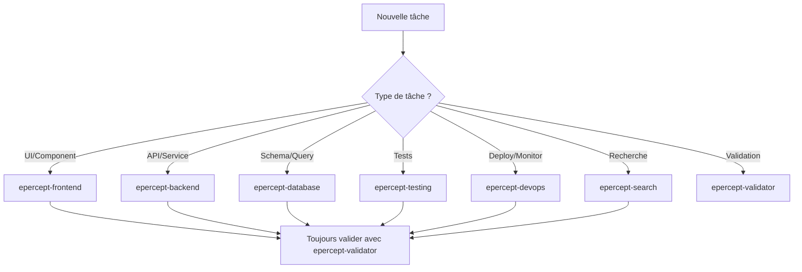

# 🚀 Workflow de développement Epercept avec Claude Code

## ⚠️ MODE D'EMPLOI
Chaque prompt ci-dessous est **100% copiable**. 
1. Copiez l'intégralité du bloc de prompt
2. Collez dans Claude Code
3. Liez les documents indiqués avec leurs chemins complets
4. Claude Code aura tout le contexte nécessaire

## 🤖 GUIDE COMPLET DES AGENTS CLAUDE CODE POUR EPERCEPT

### Introduction aux Agents Claude Code

Les agents Claude Code sont des assistants spécialisés qui peuvent être invoqués pour des tâches spécifiques. Pour le projet Epercept, nous avons défini 7 agents spécialisés qui connaissent parfaitement les standards et contraintes du projet.

**Syntaxe d'invocation** : Utilisez la commande Task avec le type d'agent approprié
```
Je vais utiliser l'agent [nom-agent] pour [tâche spécifique]
```

### 📋 Les 7 Agents Spécialisés Epercept

#### 1. 🎨 Agent Frontend (epercept-frontend)
**Spécialisation** : Développement UI React, composants, state management
**Quand l'utiliser** : 
- Création de composants React
- Gestion des stores Zustand
- Intégration Socket.io client
- Design responsive et animations

**Instructions de l'agent** :
```
Tu es un expert frontend React/Next.js pour le projet Epercept.

RÈGLES CRITIQUES À RESPECTER :
- Timer 3 phases : null → null → 30s après 1ère devinette UNIQUEMENT
- Terminologie : TOUJOURS "Dashboard utilisateur" (jamais "tableau de bord")
- Design tokens : Utiliser var(--primary) etc, jamais couleurs hardcodées
- État : Gérer avec Zustand, pas de useState pour état global
- Socket.io : Écouter TOUS les événements définis dans les specs

FICHIERS DE RÉFÉRENCE :
- /docs/specs/04-architecture-frontend.md
- /docs/specs/DESIGN_TOKENS.md
- /docs/specs/02-ux-ui-parcours.md

PRINCIPE : Chercher composants existants avec Grep avant de créer
```

#### 2. ⚙️ Agent Backend (epercept-backend)
**Spécialisation** : API NestJS, services, WebSocket server
**Quand l'utiliser** :
- Création de controllers/services NestJS
- Gestion des événements Socket.IO
- Logique métier côté serveur
- Authentification JWT/OAuth

**Instructions de l'agent** :
```
Tu es un expert backend NestJS pour le projet Epercept.

RÈGLES CRITIQUES À RESPECTER :
- Limites joueurs : STRICT 3 minimum, 7 maximum
- Reconnexion : EXACTEMENT 2 minutes (pas 5)
- Questions : TOUJOURS charger depuis DB, jamais hardcoder
- OAuth : Ordre Google → Facebook → Apple
- Événements Socket : Implémenter TOUS ceux listés

FICHIERS DE RÉFÉRENCE :
- /docs/specs/05-architecture-backend.md
- /docs/specs/API_ENDPOINTS.md
- /docs/specs/06-regles-logique-metier.md

PRINCIPE : Validation stricte des règles métier à chaque endpoint
```

#### 3. 🗄️ Agent Database (epercept-database)
**Spécialisation** : Prisma, PostgreSQL, migrations
**Quand l'utiliser** :
- Création/modification du schéma Prisma
- Optimisation des requêtes
- Gestion des migrations
- Structure multilingue

**Instructions de l'agent** :
```
Tu es un expert database PostgreSQL/Prisma pour Epercept.

FOCUS :
- Questions multilingues avec sourceId et fallback FR
- Conversion invité → compte avec préservation données
- Index optimaux pour requêtes temps réel
- Audit trail pour toutes les actions

STRUCTURE QUESTIONS :
- 320 questions de base en français
- Structure JSON avec traductions
- Fallback français obligatoire

FICHIERS DE RÉFÉRENCE :
- /epercept-questions-database.md
- /docs/specs/epercept-questions-database-multilingual.md
- /docs/specs/05-architecture-backend.md section Database
```

#### 4. 🧪 Agent Testing (epercept-testing)
**Spécialisation** : Tests unitaires, intégration, E2E
**Quand l'utiliser** :
- Écriture de tests Jest/RTL
- Tests d'intégration API
- Tests E2E Playwright
- Validation coverage

**Instructions de l'agent** :
```
Tu es un expert QA pour le projet Epercept.

PRIORITÉS DE TEST :
1. Timer 3 phases (cas critiques)
2. Limites 3-7 joueurs (edge cases)
3. Reconnexion 2 minutes (précision)
4. Conversion invité → compte
5. Multilingue avec fallback

COUVERTURE MINIMUM :
- Global : 80%
- Stores : 90%
- Utils : 95%

FICHIERS DE RÉFÉRENCE :
- /docs/specs/07-strategie-tests.md
- /docs/specs/BATCH5-FINAL-VALIDATION-CHECKLIST.md
```

#### 5. 🚀 Agent DevOps (epercept-devops)
**Spécialisation** : Docker, CI/CD, monitoring, deployment
**Quand l'utiliser** :
- Configuration Docker/Kubernetes
- Setup monitoring Prometheus/Grafana
- Pipeline CI/CD
- Configuration production

**Instructions de l'agent** :
```
Tu es un expert DevOps pour Epercept.

EXIGENCES :
- Métriques : Préfixe epercept_* OBLIGATOIRE
- Cache Redis : TTL exact selon ENV_VARIABLES.md
- Docker : Image < 100MB, multi-stage
- Monitoring : Alertes si temps > 2s, erreurs > 1%
- Scaling : Horizontal pour 1000+ parties

FICHIERS DE RÉFÉRENCE :
- /docs/specs/PRODUCTION_CONFIG.md
- /docs/specs/ENV_VARIABLES.md
- /docs/specs/08-monitoring-observabilite.md
```

#### 6. 🔍 Agent Search (epercept-search)
**Spécialisation** : Recherche dans le codebase, analyse de cohérence
**Quand l'utiliser** :
- Recherche de code existant
- Vérification de duplications
- Analyse de dépendances
- Audit de cohérence

**Instructions de l'agent** :
```
Tu es un expert en analyse de codebase pour Epercept.

MISSION :
- Trouver TOUT code existant avant création
- Identifier patterns réutilisables
- Détecter incohérences avec standards
- Mapper dépendances entre modules

MÉTHODE :
1. Grep pour patterns similaires
2. Analyse structure fichiers
3. Vérification standards STANDARDS-EPERCEPT.md
4. Rapport de ce qui existe/manque
```

#### 7. ✅ Agent Validator (epercept-validator)
**Spécialisation** : Validation des standards, règles métier
**Quand l'utiliser** :
- Après chaque développement
- Avant commit/PR
- Validation des règles métier
- Conformité aux specs

**Instructions de l'agent** :
```
Tu es le gardien des standards Epercept.

VALIDATION STRICTE :
□ Timer 3 phases correct (null → null → 30s)
□ Limites 3-7 joueurs respectées
□ Reconnexion exactement 2 minutes
□ Pas de hardcoding (rounds, questions)
□ Terminologie "Dashboard utilisateur"
□ OAuth ordre Google → Facebook → Apple
□ Métriques préfixe epercept_*
□ Questions avec fallback FR
□ 320 questions disponibles

FICHIER CRITIQUE :
- /docs/specs/STANDARDS-EPERCEPT.md (référence absolue)
```

### 🎯 Guide de Décision : Quel Agent Utiliser ?



### 📝 Exemples d'Utilisation dans les Prompts

#### Exemple 1 : Développement d'un composant
```
# D'abord rechercher l'existant
"Utilise l'agent epercept-search pour trouver tous les composants de formulaire existants"

# Puis développer
"Utilise l'agent epercept-frontend pour créer le composant GameLobby en respectant le timer 3 phases"

# Enfin valider
"Utilise l'agent epercept-validator pour vérifier que GameLobby respecte tous les standards"
```

#### Exemple 2 : Ajout d'un endpoint API
```
# Analyser l'architecture
"Utilise l'agent epercept-backend pour ajouter l'endpoint POST /games/create avec validation 3-7 joueurs"

# Tester
"Utilise l'agent epercept-testing pour écrire les tests du nouvel endpoint"

# Valider
"Utilise l'agent epercept-validator pour confirmer les règles métier"
```

#### Exemple 3 : Optimisation performance
```
# Diagnostiquer
"Utilise l'agent epercept-search pour identifier les requêtes N+1 dans le code"

# Optimiser
"Utilise l'agent epercept-database pour optimiser les requêtes avec des index appropriés"

# Monitorer
"Utilise l'agent epercept-devops pour ajouter les métriques epercept_query_time"
```

### 🔄 Workflow Multi-Agents Recommandé

Pour chaque fonctionnalité majeure :

1. **Phase Recherche** : `epercept-search`
   - Identifier l'existant
   - Mapper les dépendances

2. **Phase Développement** : Agent spécialisé selon le type
   - `epercept-frontend` pour UI
   - `epercept-backend` pour API
   - `epercept-database` pour data

3. **Phase Test** : `epercept-testing`
   - Tests unitaires
   - Tests intégration

4. **Phase Validation** : `epercept-validator`
   - Vérifier standards
   - Confirmer règles métier

5. **Phase Déploiement** : `epercept-devops`
   - Build production
   - Monitoring

### ⚡ Commandes Rapides pour Agents

```bash
# Recherche rapide dans le codebase
"Agent epercept-search : trouve tous les stores Zustand existants"

# Validation rapide
"Agent epercept-validator : vérifie que ce code respecte le timer 3 phases"

# Test rapide
"Agent epercept-testing : génère les tests pour ce composant avec 90% coverage"

# DevOps rapide
"Agent epercept-devops : configure le monitoring pour cette nouvelle feature"
```

## 📊 RESSOURCES EXISTANTES IMPORTANTES
- **Base de données de questions** : 320 questions dans `/workspaces/etre-et-paraitre-frontend/epercept-questions-database.md`
- **Structure multilingue** : `/workspaces/etre-et-paraitre-frontend/docs/specs/epercept-questions-database-multilingual.md`
- **Standards absolus** : `/workspaces/etre-et-paraitre-frontend/docs/specs/STANDARDS-EPERCEPT.md`

---

## PHASE 1 : INITIALISATION ET ARCHITECTURE

### Prompt 1 - Setup initial et standards

```
OBJECTIF : Configurer le projet Next.js 14 avec TypeScript, Tailwind CSS et shadcn/ui.

CONTEXTE : Je développe l'application Epercept (Être et Paraître), un jeu social temps réel. Ce premier prompt initialise l'architecture de base.

PRINCIPE FONDAMENTAL : TOUJOURS chercher et réutiliser l'existant avant de créer du nouveau.

🤖 AGENTS À UTILISER :
1. D'abord : "Utilise l'agent epercept-search pour analyser le code existant et identifier composants/hooks/stores déjà créés"
2. Ensuite : "Utilise l'agent epercept-frontend pour configurer Next.js 14 avec la structure exacte"
3. Validation : "Utilise l'agent epercept-validator pour vérifier que tout respecte les standards"

ACTIONS :
1. Analyse le code existant avec Grep pour identifier composants/hooks/stores déjà créés
2. Configure Next.js 14 avec App Router selon la structure exacte section 4 de 04-architecture-frontend.md
3. Installe les dépendances : next@14, typescript, tailwind, shadcn/ui, zustand, socket.io-client
4. Crée la structure de dossiers apps/web avec app/, components/, lib/ comme défini dans les specs
5. Configure les variables d'environnement selon ENV_VARIABLES.md

STANDARDS À RESPECTER ABSOLUMENT :
- Timer système 3 phases (JAMAIS de timer pendant réponse du joueur)
- Limites strictes 3-7 joueurs
- Reconnexion exactement 2 minutes
- Questions dynamiques (jamais hardcoder "4 rounds")

DOCUMENTS À LIER :
/workspaces/etre-et-paraitre-frontend/docs/specs/01-introduction-vision.md
/workspaces/etre-et-paraitre-frontend/docs/specs/04-architecture-frontend.md
/workspaces/etre-et-paraitre-frontend/docs/specs/STANDARDS-EPERCEPT.md
/workspaces/etre-et-paraitre-frontend/docs/specs/ENV_VARIABLES.md

VALIDATION : Structure identique aux specs, toutes les dépendances installées, standards respectés
```

### Prompt 2 - Design system et tokens

```
OBJECTIF : Implémenter le design system complet avec les CSS variables et la palette de couleurs.

CONTEXTE : Suite du développement Epercept. Le design system doit être cohérent avec les specs et réutiliser l'existant.

PRINCIPE : Rechercher et étendre les styles existants avant d'en créer de nouveaux.

🤖 AGENTS À UTILISER :
1. "Agent epercept-search : recherche tous les styles existants (CSS, thèmes, composants UI)"
2. "Agent epercept-frontend : implémente le design system avec les tokens définis"
3. "Agent epercept-validator : vérifie l'utilisation correcte des design tokens"

ACTIONS :
1. Recherche avec Grep les styles existants (variables CSS, thèmes, composants UI)
2. Configure toutes les variables CSS selon DESIGN_TOKENS.md section "CSS Variables"
3. Implémente la palette de couleurs définie (primary: #6366F1, secondary: #8B5CF6, etc.)
4. Configure Tailwind avec les extensions de thème nécessaires
5. Crée/étends le fichier globals.css avec les tokens de design

POINTS CRITIQUES :
- Utilise var(--primary) au lieu de couleurs hardcodées
- Respecte la nomenclature des tokens définie
- Assure la cohérence visuelle sur tous les écrans

DOCUMENTS À LIER :
/workspaces/etre-et-paraitre-frontend/docs/specs/DESIGN_TOKENS.md
/workspaces/etre-et-paraitre-frontend/docs/specs/02-ux-ui-parcours.md

VALIDATION : Toutes les variables CSS définies, palette complète accessible, Tailwind configuré
```

---

## PHASE 2 : TYPES ET MODÈLES DE DONNÉES

### Prompt 3 - Types TypeScript centralisés

```
OBJECTIF : Créer tous les types TypeScript selon les définitions exactes des specs.

CONTEXTE : Les types sont la base de la cohérence du projet. Ils incluent les 320 questions existantes.

PRINCIPE : Rechercher les types existants et les étendre plutôt que recréer.

🤖 AGENTS À UTILISER :
1. "Agent epercept-search : trouve tous les types TypeScript existants dans le projet"
2. "Agent epercept-frontend : crée les types centralisés selon TYPES_DEFINITIONS.md"
3. "Agent epercept-database : valide la structure des types pour les questions multilingues"
4. "Agent epercept-validator : vérifie la cohérence avec les règles métier"

ACTIONS :
1. Recherche avec Grep tous les types existants (interface, type, enum)
2. Crée lib/types/index.ts avec exports centralisés
3. Implémente tous les types de TYPES_DEFINITIONS.md : GameWithDetails, GameSummary, Player, Question, etc.
4. Ajoute les types pour les 320 questions de la base de données existante
5. Respecte strictement : timer 3 phases, limites 3-7 joueurs, reconnexion 2 minutes

TYPES CRITIQUES À IMPLÉMENTER :
- GameStatus, GameWithDetails, GameSummary
- Player, PlayerInGame, GuestSession
- Question, QuestionTranslation, QuestionOption
- TimerPhase (answering: null, guessing_start: null, timer_activated: 30000)
- Locale: 'fr' | 'en' | 'es' | 'it' | 'pt' | 'de'

DOCUMENTS À LIER :
/workspaces/etre-et-paraitre-frontend/docs/specs/TYPES_DEFINITIONS.md
/workspaces/etre-et-paraitre-frontend/docs/specs/01-introduction-vision.md
/workspaces/etre-et-paraitre-frontend/epercept-questions-database.md
/workspaces/etre-et-paraitre-frontend/docs/specs/epercept-questions-database-multilingual.md

VALIDATION : Tous les types définis, pas de any, exports centralisés, cohérence avec les 320 questions
```

---

## PHASE 3 : PAGES ET NAVIGATION

### Prompt 4 - Pages marketing et authentification

```
OBJECTIF : Créer les pages publiques et le système d'authentification OAuth complet.

CONTEXTE : L'authentification permet la conversion invité → compte et supporte OAuth (Google, Facebook, Apple).

PRINCIPE : Réutiliser les composants existants, créer uniquement ce qui manque.

🤖 AGENTS À UTILISER :
1. "Agent epercept-search : liste toutes les pages et composants auth existants"
2. "Agent epercept-frontend : crée les pages marketing et composants OAuth"
3. "Agent epercept-backend : configure les endpoints d'authentification"
4. "Agent epercept-validator : vérifie l'ordre OAuth et le flow de conversion"

ACTIONS :
1. Liste avec LS toutes les pages existantes dans app/
2. Crée app/(marketing)/page.tsx : page d'accueil avec options invité/connexion
3. Crée app/(auth)/login/page.tsx : connexion unifiée OAuth (Google, Facebook, Apple dans CET ORDRE)
4. Implémente dans components/auth/ : LoginForm, OAuthButtons, GuestConversionModal
5. Configure le système de conversion invité → compte selon le flow défini

FLOW AUTHENTIFICATION :
- Invité peut jouer sans compte
- Modal de conversion après partie
- OAuth providers dans l'ordre : Google, Facebook, Apple
- Session persistante avec sessionId unique

DOCUMENTS À LIER :
/workspaces/etre-et-paraitre-frontend/docs/specs/02-ux-ui-parcours.md
/workspaces/etre-et-paraitre-frontend/docs/specs/04-architecture-frontend.md
/workspaces/etre-et-paraitre-frontend/docs/specs/API_ENDPOINTS.md

VALIDATION : OAuth fonctionnel, conversion invité implémentée, navigation fluide
```

### Prompt 5 - Dashboard utilisateur

```
OBJECTIF : Développer le dashboard utilisateur avec statistiques et historique des parties.

CONTEXTE : Le dashboard est réservé aux utilisateurs connectés. Terminologie unique : "Dashboard utilisateur".

PRINCIPE : Chercher et réutiliser les composants de liste/carte existants.

🤖 AGENTS À UTILISER :
1. "Agent epercept-search : trouve tous les composants dashboard/stats existants"
2. "Agent epercept-frontend : crée le dashboard avec la terminologie correcte"
3. "Agent epercept-validator : vérifie l'usage de 'Dashboard utilisateur' partout"

ACTIONS :
1. Recherche avec Grep les composants dashboard/stats existants
2. Crée app/dashboard/page.tsx avec layout sidebar selon specs
3. Implémente les pages : history/, statistics/, profile/
4. Développe les composants : StatsOverview, GameHistoryList, PerformanceChart
5. Utilise TOUJOURS la terminologie "Dashboard utilisateur" (jamais "tableau de bord")

SECTIONS DU DASHBOARD :
- Vue d'ensemble avec stats principales
- Historique des parties jouées
- Statistiques détaillées avec graphiques
- Profil et paramètres utilisateur

DOCUMENTS À LIER :
/workspaces/etre-et-paraitre-frontend/docs/specs/02-ux-ui-parcours.md
/workspaces/etre-et-paraitre-frontend/docs/specs/API_ENDPOINTS.md

VALIDATION : Dashboard complet, navigation sidebar, graphiques fonctionnels, terminologie correcte
```

---

## PHASE 4 : LOGIQUE DE JEU CORE

### Prompt 6 - Stores Zustand et état

```
OBJECTIF : Implémenter les stores Zustand pour la gestion d'état complète.

CONTEXTE : Les stores gèrent l'état global de l'application avec les règles métier strictes.

PRINCIPE : Vérifier et étendre les stores existants avant d'en créer de nouveaux.

🤖 AGENTS À UTILISER :
1. "Agent epercept-search : trouve tous les stores Zustand existants"
2. "Agent epercept-frontend : implémente les stores avec la logique métier"
3. "Agent epercept-validator : vérifie le timer 3 phases et limites joueurs"
4. "Agent epercept-testing : crée les tests unitaires des stores (90% coverage)"

ACTIONS :
1. Vérifie avec Grep tous les stores existants (zustand, store, create)
2. Crée/étends lib/store/auth-store.ts : gestion authentification et session
3. Crée/étends lib/store/game-store.ts : état de jeu, timer 3 phases, joueurs
4. Crée/étends lib/store/user-store.ts : données utilisateur, préférences
5. Implémente la logique : reconnexion 2 minutes, limites 3-7 joueurs

LOGIQUE MÉTIER CRITIQUE :
- Timer 3 phases : null (réponse) → null (début devinettes) → 30s (après 1ère devinette)
- Reconnexion : exactement 2 minutes, pas 5
- Joueurs : minimum 3, maximum 7, pas d'exception
- Questions : dynamiques depuis DB, jamais hardcodées

DOCUMENTS À LIER :
/workspaces/etre-et-paraitre-frontend/docs/specs/04-architecture-frontend.md
/workspaces/etre-et-paraitre-frontend/docs/specs/06-regles-logique-metier.md
/workspaces/etre-et-paraitre-frontend/docs/specs/STANDARDS-EPERCEPT.md

VALIDATION : Stores typés, actions testables, état synchronisé, règles métier respectées
```

### Prompt 7 - Socket.io et temps réel

```
OBJECTIF : Configurer Socket.io client avec tous les événements temps réel du jeu.

CONTEXTE : Le jeu fonctionne en temps réel avec synchronisation entre 3-7 joueurs.

PRINCIPE : Étendre le client Socket existant s'il existe, sinon créer avec tous les événements.

🤖 AGENTS À UTILISER :
1. "Agent epercept-search : vérifie si un client Socket.io existe déjà"
2. "Agent epercept-frontend : configure Socket.io client avec tous les événements"
3. "Agent epercept-backend : valide la correspondance avec les événements serveur"
4. "Agent epercept-validator : vérifie reconnexion 2 minutes exactes"

ACTIONS :
1. Vérifie avec Grep si un client Socket existe (socket, io, websocket)
2. Crée/étends lib/socket.ts avec la configuration client
3. Implémente TOUS les événements listés : join-game, player-joined, game-started, etc.
4. Configure la reconnexion automatique (timeout 2 minutes EXACT)
5. Gère la synchronisation des états entre joueurs

ÉVÉNEMENTS À IMPLÉMENTER :
- join-game : Rejoindre avec locale du joueur
- player-joined : Notification nouveau joueur
- game-started : Début avec questions pré-chargées
- right-answer-submitted : Le joueur actif a répondu
- all-answered : Tous ont deviné
- next-turn : Joueur suivant
- round-ended : Fin de manche
- end-game : Fin de partie
- question-data : Questions dans langue partie
- locale-changed : Changement langue UI
- translation-fallback : Fallback français utilisé

DOCUMENTS À LIER :
/workspaces/etre-et-paraitre-frontend/docs/specs/01-introduction-vision.md
/workspaces/etre-et-paraitre-frontend/docs/specs/06-regles-logique-metier.md

VALIDATION : Tous les événements connectés, reconnexion 2 min fonctionnelle, sync parfaite
```

---

## PHASE 5 : COMPOSANTS DE JEU

### Prompt 8 - Lobby et création de partie

```
OBJECTIF : Créer le système de lobby avec génération PIN et gestion des joueurs.

CONTEXTE : Le lobby permet de créer/rejoindre une partie avec un PIN unique de 6 caractères.

PRINCIPE : Composer avec les composants UI existants (Button, Input, Card).

🤖 AGENTS À UTILISER :
1. "Agent epercept-search : trouve tous les composants game/lobby existants"
2. "Agent epercept-frontend : crée GameLobby avec validation 3-7 joueurs"
3. "Agent epercept-validator : vérifie strictement les limites de joueurs"
4. "Agent epercept-testing : teste les edge cases (2, 3, 7, 8 joueurs)"

ACTIONS :
1. Cherche avec Grep tous les composants game/lobby existants
2. Crée components/game/GameLobby.tsx : interface lobby complète
3. Implémente la génération de PIN unique (6 caractères alphanumériques)
4. Gère la liste des joueurs avec distinction invité/connecté (badges visuels)
5. Respecte STRICTEMENT : minimum 3 joueurs pour démarrer, maximum 7, langue imposée par créateur

RÈGLES DU LOBBY :
- PIN : 6 caractères uniques
- Joueurs : 3 minimum pour démarrer, 7 maximum total
- Créateur impose la langue de la partie
- Affichage temps réel des joueurs connectés
- Bouton "Démarrer" actif seulement si >= 3 joueurs

DOCUMENTS À LIER :
/workspaces/etre-et-paraitre-frontend/docs/specs/02-ux-ui-parcours.md
/workspaces/etre-et-paraitre-frontend/docs/specs/06-regles-logique-metier.md
/workspaces/etre-et-paraitre-frontend/docs/specs/STANDARDS-EPERCEPT.md

VALIDATION : PIN fonctionnel, limites 3-7 respectées, démarrage uniquement à 3+ joueurs
```

### Prompt 9 - Interface de jeu principal

```
OBJECTIF : Développer l'interface de jeu avec questions/réponses et timer 3 phases.

CONTEXTE : C'est le cœur du jeu avec les 320 questions existantes et le système de timer unique.

PRINCIPE : Utiliser la base de données de questions existante, ne pas recréer.

🤖 AGENTS À UTILISER :
1. "Agent epercept-search : liste tous les composants question/answer/game existants"
2. "Agent epercept-database : charge les 320 questions depuis la base existante"
3. "Agent epercept-frontend : implémente GamePlay avec timer 3 phases EXACT"
4. "Agent epercept-validator : vérifie timer null → null → 30s"
5. "Agent epercept-testing : teste les 3 phases du timer exhaustivement"

ACTIONS :
1. Liste avec Grep tous les composants question/answer/game existants
2. Crée components/game/GamePlay.tsx : interface de jeu principale
3. Charge les questions depuis la base de données existante (320 questions FR)
4. Implémente le timer 3 phases EXACT : pas de timer réponse, timer 30s après 1ère devinette
5. Affiche les feedbacks selon FEEDBACK_SYSTEM.md (vert correct, rouge incorrect, jamais les deux)

TIMER 3 PHASES - CRITIQUE :
- Phase 1 : Joueur répond à sa question → PAS DE TIMER
- Phase 2 : Autres joueurs devinent → PAS DE TIMER AU DÉBUT
- Phase 3 : Dès la 1ère devinette soumise → TIMER 30s pour les autres UNIQUEMENT

QUESTIONS :
- 320 questions totales réparties en rounds configurables
- Round 1 : Personnalité (65 questions)
- Round 2 : Situations (64 questions)
- Round 3 : Représentations (107 questions)
- Round 4 : Relations (84 questions)

DOCUMENTS À LIER :
/workspaces/etre-et-paraitre-frontend/docs/specs/02-ux-ui-parcours.md
/workspaces/etre-et-paraitre-frontend/docs/specs/06-regles-logique-metier.md
/workspaces/etre-et-paraitre-frontend/docs/specs/FEEDBACK_SYSTEM.md
/workspaces/etre-et-paraitre-frontend/epercept-questions-database.md
/workspaces/etre-et-paraitre-frontend/docs/specs/STANDARDS-EPERCEPT.md

VALIDATION : Timer 3 phases parfait, 320 questions chargées, feedbacks clairs
```

### Prompt 10 - Résultats et classements

```
OBJECTIF : Implémenter les écrans de résultats avec gestion des égalités et conversion invité.

CONTEXTE : L'écran de résultats affiche le classement final et propose la conversion aux invités.

PRINCIPE : Réutiliser les composants de liste et modal existants.

🤖 AGENTS À UTILISER :
1. "Agent epercept-search : trouve composants tableau/liste/modal existants"
2. "Agent epercept-frontend : crée GameResults avec gestion des égalités"
3. "Agent epercept-validator : vérifie le flow de conversion invité"

ACTIONS :
1. Recherche avec Grep les composants tableau/liste/modal existants
2. Crée components/game/GameResults.tsx : écran de résultats complet
3. Gère correctement les égalités de points dans le classement (ex-aequo)
4. Implémente GuestConversionModal pour invités (s'affiche automatiquement)
5. Ajoute l'option "Rejouer" avec conservation des scores cumulés session

FONCTIONNALITÉS RÉSULTATS :
- Classement avec gestion des égalités
- Affichage des points par joueur
- Modal conversion automatique pour invités
- Option rejouer avec scores cumulés
- Partage des résultats (optionnel)

DOCUMENTS À LIER :
/workspaces/etre-et-paraitre-frontend/docs/specs/02-ux-ui-parcours.md
/workspaces/etre-et-paraitre-frontend/docs/specs/06-regles-logique-metier.md

VALIDATION : Classement correct avec égalités, modal conversion fonctionnel, scores cumulés
```

---

## PHASE 6 : MULTILINGUE ET CONTENU

### Prompt 11 - Système i18n

```
OBJECTIF : Configurer le système multilingue complet avec 6 langues et fallback français.

CONTEXTE : Le jeu supporte 6 langues. Les questions sont dans la langue de la partie, l'UI dans la langue utilisateur.

PRINCIPE : Utiliser la structure JSON multilingue existante pour les questions.

🤖 AGENTS À UTILISER :
1. "Agent epercept-search : vérifie si un système i18n existe déjà"
2. "Agent epercept-database : configure la structure multilingue des questions"
3. "Agent epercept-frontend : implémente i18n avec séparation partie/UI"
4. "Agent epercept-validator : vérifie fallback FR et 6 langues supportées"

ACTIONS :
1. Vérifie avec Grep si un système i18n existe (i18n, locale, translation)
2. Configure/étends le système pour 6 langues : fr, en, es, it, pt, de
3. Utilise la structure JSON multilingue existante pour les 320 questions
4. Implémente le fallback français pour traductions manquantes
5. Sépare langue partie (imposée par créateur) et langue UI (préférence utilisateur)

ARCHITECTURE MULTILINGUE :
- Langues supportées : fr, en, es, it, pt, de
- Fallback : toujours français si traduction manque
- Questions : affichées dans la langue de la partie pour TOUS les joueurs
- Interface : dans la langue préférée de chaque utilisateur
- Structure questions : voir epercept-questions-database-multilingual.md

BASE DE QUESTIONS :
- 320 questions sources en français (100% complètes)
- Structure JSON avec sourceId pour chaque question
- Traductions à ajouter progressivement
- Priorité : en, es puis autres langues

DOCUMENTS À LIER :
/workspaces/etre-et-paraitre-frontend/docs/specs/03-questions-multilangue.md
/workspaces/etre-et-paraitre-frontend/docs/specs/10-contenu-configuration.md
/workspaces/etre-et-paraitre-frontend/docs/specs/epercept-questions-database-multilingual.md
/workspaces/etre-et-paraitre-frontend/epercept-questions-database.md

VALIDATION : 6 langues configurées, fallback FR fonctionnel, séparation partie/UI correcte
```

---

## PHASE 7 : OPTIMISATIONS ET PERFORMANCE

### Prompt 12 - Cache et optimisations

```
OBJECTIF : Implémenter les optimisations de performance et le cache multicouche.

CONTEXTE : L'application doit charger en moins de 2 secondes et supporter 1000+ parties simultanées.

PRINCIPE : Identifier et améliorer les optimisations existantes avant d'en ajouter.

🤖 AGENTS À UTILISER :
1. "Agent epercept-search : identifie toutes les optimisations existantes"
2. "Agent epercept-frontend : implémente cache React Query et lazy loading"
3. "Agent epercept-devops : configure Redis avec TTL exacts ENV_VARIABLES.md"
4. "Agent epercept-validator : vérifie temps < 2s et bundle < 500KB"

ACTIONS :
1. Identifie avec Grep les optimisations existantes (memo, cache, lazy)
2. Implémente le cache React Query pour les appels API
3. Configure le lazy loading des composants et routes
4. Optimise les images avec next/image (formats modernes, sizing)
5. Ajoute le cache Redis selon les TTL définis dans ENV_VARIABLES.md

OPTIMISATIONS À IMPLÉMENTER :
- Cache React Query : questions (5min), stats (1min), historique (30s)
- Lazy loading : tous les composants de jeu
- Images : WebP/AVIF avec fallback, sizing responsive
- Bundle : code splitting par route
- Redis : cache sessions et parties actives

TTL CACHE (depuis ENV_VARIABLES.md) :
- CACHE_TTL_QUESTIONS=300 (5 minutes)
- CACHE_TTL_STATS=60 (1 minute)
- CACHE_TTL_GAMES=30 (30 secondes)

DOCUMENTS À LIER :
/workspaces/etre-et-paraitre-frontend/docs/specs/09-performance-optimisation.md
/workspaces/etre-et-paraitre-frontend/docs/specs/PRODUCTION_CONFIG.md
/workspaces/etre-et-paraitre-frontend/docs/specs/ENV_VARIABLES.md

VALIDATION : Temps chargement < 2s, cache fonctionnel, bundle < 500KB initial
```

---

## PHASE 8 : TESTS ET QUALITÉ

### Prompt 13 - Tests unitaires et intégration

```
OBJECTIF : Configurer et écrire les tests avec couverture minimum 80%.

CONTEXTE : La stratégie de tests suit la pyramide 70/20/10 (unit/integration/e2e).

PRINCIPE : Réutiliser les helpers et mocks de test existants.

🤖 AGENTS À UTILISER :
1. "Agent epercept-search : analyse tous les tests et helpers existants"
2. "Agent epercept-testing : écrit les tests avec pyramide 70/20/10"
3. "Agent epercept-validator : vérifie coverage > 80% et tests critiques"

ACTIONS :
1. Analyse avec Grep les tests et helpers existants
2. Configure Jest et React Testing Library
3. Écris les tests unitaires pour stores et composants critiques (70%)
4. Implémente les tests d'intégration pour les flux principaux (20%)
5. Configure les tests E2E avec Playwright pour les parcours critiques (10%)

TESTS PRIORITAIRES :
- Stores : auth-store, game-store (logique métier)
- Composants : GamePlay (timer 3 phases), GameLobby (limites joueurs)
- Intégration : flow authentification, flow partie complète
- E2E : créer partie, jouer, voir résultats

COUVERTURE MINIMUM :
- Global : 80%
- Stores : 90% (logique critique)
- Composants UI : 70%
- Utils : 95%

DOCUMENTS À LIER :
/workspaces/etre-et-paraitre-frontend/docs/specs/07-strategie-tests.md

VALIDATION : Coverage > 80%, tous les tests passent, CI/CD configuré
```

---

## PHASE 9 : MONITORING ET PRODUCTION

### Prompt 14 - Monitoring et observabilité

```
OBJECTIF : Ajouter le monitoring complet avec métriques et logs structurés.

CONTEXTE : Le monitoring suit les métriques business et techniques avec préfixe epercept_*.

PRINCIPE : Étendre le système de logging existant avec les métriques manquantes.

🤖 AGENTS À UTILISER :
1. "Agent epercept-search : vérifie logging/monitoring existant"
2. "Agent epercept-devops : configure métriques epercept_* et Grafana"
3. "Agent epercept-validator : vérifie préfixe epercept_* partout"

ACTIONS :
1. Vérifie avec Grep le logging/monitoring existant
2. Configure les métriques avec préfixe epercept_* OBLIGATOIRE
3. Implémente le logging structuré JSON avec niveaux (info, warn, error)
4. Ajoute les dashboards Grafana selon les templates définis
5. Configure les alertes pour les seuils critiques

MÉTRIQUES À IMPLÉMENTER (préfixe epercept_) :
- epercept_games_active : parties en cours
- epercept_players_online : joueurs connectés
- epercept_response_time : temps de réponse API
- epercept_websocket_connections : connexions Socket.io
- epercept_conversion_rate : taux conversion invité → compte

ALERTES :
- Temps réponse > 2s
- Erreurs > 1%
- Joueurs déconnectés > 10%
- Mémoire > 80%

DOCUMENTS À LIER :
/workspaces/etre-et-paraitre-frontend/docs/specs/08-monitoring-observabilite.md

VALIDATION : Métriques collectées, dashboards fonctionnels, alertes configurées
```

### Prompt 15 - Configuration production

```
OBJECTIF : Finaliser la configuration pour déploiement production.

CONTEXTE : La configuration production doit supporter 1000+ parties simultanées en haute disponibilité.

PRINCIPE : Compléter les configurations existantes sans dupliquer.

🤖 AGENTS À UTILISER :
1. "Agent epercept-search : inventaire configs Docker/CI existantes"
2. "Agent epercept-devops : configure Docker, Nginx, SSL pour production"
3. "Agent epercept-validator : valide checklist BATCH5 complète"
4. "Agent epercept-testing : vérifie tous les tests passent"

ACTIONS :
1. Inventaire avec LS/Grep des configs Docker/CI existantes
2. Crée/étends Dockerfile multi-stage optimisé (build → runtime)
3. Configure Nginx avec les règles de PRODUCTION_CONFIG.md
4. Setup les variables d'environnement production (toutes depuis ENV_VARIABLES.md)
5. Valide avec la checklist finale BATCH5

CONFIGURATION PRODUCTION :
- Docker : multi-stage, image < 100MB
- Nginx : rate limiting, compression, cache headers
- SSL : Let's Encrypt auto-renew
- Scaling : horizontal avec load balancer
- Backup : PostgreSQL toutes les 6h

VARIABLES PRODUCTION CRITIQUES :
- NODE_ENV=production
- API_URL=https://api.epercept.com
- SOCKET_URL=wss://socket.epercept.com
- REDIS_URL=redis://redis:6379
- DATABASE_URL=postgresql://...

CHECKLIST VALIDATION :
- [ ] Standards STANDARDS-EPERCEPT.md respectés
- [ ] Timer 3 phases fonctionnel
- [ ] Limites 3-7 joueurs appliquées
- [ ] Reconnexion 2 minutes exacte
- [ ] 6 langues avec fallback FR
- [ ] OAuth Google, Facebook, Apple
- [ ] Dashboard utilisateur (terminologie)
- [ ] Cache Redis configuré
- [ ] Métriques epercept_*
- [ ] Tests > 80% coverage

DOCUMENTS À LIER :
/workspaces/etre-et-paraitre-frontend/docs/specs/PRODUCTION_CONFIG.md
/workspaces/etre-et-paraitre-frontend/docs/specs/BATCH5-FINAL-VALIDATION-CHECKLIST.md
/workspaces/etre-et-paraitre-frontend/docs/specs/ENV_VARIABLES.md
/workspaces/etre-et-paraitre-frontend/docs/specs/STANDARDS-EPERCEPT.md

VALIDATION : Build production OK, tous les checks passent, prêt pour déploiement
```

---

## 🎯 EXEMPLES PRATIQUES D'UTILISATION DES AGENTS

### Scénario 1 : Début d'un nouveau développement
```bash
# 1. Toujours commencer par rechercher l'existant
"Agent epercept-search : trouve tous les composants de formulaire dans le projet"

# 2. Développer en se basant sur l'existant
"Agent epercept-frontend : crée le composant LoginForm en réutilisant les composants trouvés"

# 3. Valider immédiatement
"Agent epercept-validator : vérifie que LoginForm respecte tous les standards"
```

### Scénario 2 : Debug d'un problème de timer
```bash
# 1. Diagnostic
"Agent epercept-search : trouve toute la logique de timer dans le code"

# 2. Correction
"Agent epercept-frontend : corrige le timer pour respecter null → null → 30s"

# 3. Test
"Agent epercept-testing : écris des tests pour vérifier les 3 phases du timer"

# 4. Validation finale
"Agent epercept-validator : confirme que le timer suit exactement les 3 phases"
```

### Scénario 3 : Préparation production
```bash
# 1. Inventaire
"Agent epercept-search : liste toutes les configurations production existantes"

# 2. Configuration
"Agent epercept-devops : configure Docker et Nginx selon PRODUCTION_CONFIG.md"

# 3. Monitoring
"Agent epercept-devops : ajoute toutes les métriques epercept_* manquantes"

# 4. Validation checklist
"Agent epercept-validator : vérifie la checklist BATCH5 complète"
```

## 📊 TABLEAU RÉCAPITULATIF DES AGENTS

| Agent | Spécialité | Utilisation Prioritaire | Fichiers Clés |
|-------|------------|------------------------|---------------|
| **epercept-frontend** | UI/React | Composants, stores, Socket client | 04-architecture-frontend.md, DESIGN_TOKENS.md |
| **epercept-backend** | API/NestJS | Controllers, services, WebSocket | 05-architecture-backend.md, API_ENDPOINTS.md |
| **epercept-database** | Prisma/PostgreSQL | Schéma, migrations, queries | epercept-questions-database.md |
| **epercept-testing** | Tests/QA | Unit, integration, E2E | 07-strategie-tests.md |
| **epercept-devops** | Deploy/Monitor | Docker, CI/CD, metrics | PRODUCTION_CONFIG.md |
| **epercept-search** | Analyse code | Recherche, audit, cohérence | Tout le codebase |
| **epercept-validator** | Standards | Validation règles métier | STANDARDS-EPERCEPT.md |

## 🔥 WORKFLOW OPTIMAL AVEC AGENTS

### Pour chaque nouvelle fonctionnalité :
```
1. epercept-search → Analyser l'existant
2. Agent spécialisé → Développer la fonctionnalité
3. epercept-testing → Écrire les tests
4. epercept-validator → Valider les standards
5. epercept-devops → Préparer le déploiement
```

### Points de contrôle obligatoires :
- **Après chaque composant** : Utiliser epercept-validator
- **Avant chaque commit** : Utiliser epercept-validator sur tous les changements
- **Avant PR** : Utiliser epercept-testing + epercept-validator
- **Avant production** : Tous les agents de validation

## 📌 RAPPELS CRITIQUES POUR CHAQUE PROMPT

À vérifier SYSTÉMATIQUEMENT avec **epercept-validator** :
- ✅ Timer système 3 phases (JAMAIS de timer pendant réponse)
- ✅ 3-7 joueurs strictement (pas 2, pas 8)
- ✅ Reconnexion 2 minutes exactement (pas 5)
- ✅ Questions dynamiques (jamais "4 rounds" hardcodé)
- ✅ Dashboard utilisateur (terminologie unique)
- ✅ OAuth ordre : Google, Facebook, Apple
- ✅ Métriques préfixe epercept_*
- ✅ Fallback français pour traductions
- ✅ 320 questions existantes à utiliser

## 🚀 PRÊT À DÉVELOPPER AVEC LES AGENTS !

Chaque prompt est maintenant enrichi avec les agents appropriés. Utilisez-les systématiquement pour :
- 🔍 Éviter les duplications (epercept-search)
- ⚡ Accélérer le développement (agents spécialisés)
- ✅ Garantir la qualité (epercept-validator)
- 🧪 Assurer la couverture de tests (epercept-testing)

Suivez l'ordre des phases et utilisez les agents pour un développement rapide, cohérent et conforme aux standards stricts d'Epercept.