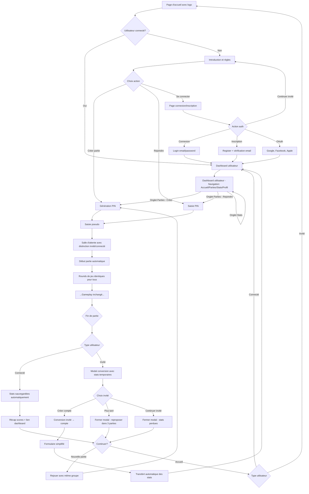

## 3. UX/UI et parcours utilisateur

### 3.1 Customer Journey détaillé (ÉTENDU avec authentification)



#### *** NOUVEAUTÉ: Parcours de conversion invité → compte ***

##### Déclenchement automatique
1. **Fin de partie** : Modal s'affiche automatiquement pour tous les invités
2. **Conditions** : Après chaque partie terminée (selon configuration admin)
3. **Fréquence** : Reproposé toutes les 3 parties si refusé avec "Plus tard"
4. **Abandon** : Si "Continuer en invité" → pas de reproposition dans la session

##### Contenu persuasif de la modal
```
🎯 Sauvegardez vos exploits !

Cette session:
• 2 parties jouées
• Meilleur score: 847 points  
• Position moyenne: 2ème/4

Créez votre compte pour:
✅ Historique permanent de toutes vos parties
✅ Statistiques détaillées et graphiques d'évolution  
✅ Dashboard utilisateur avec vos performances
✅ Classement et comparaisons avec d'autres joueurs

[Formulaire: Prénom | Nom | Email | Mot de passe]
□ J'accepte les conditions d'utilisation

[🔥 Créer mon compte]    [⏰ Plus tard]    [📝 Continuer en invité]
```

##### Processus de conversion technique
1. **Collecte données** : Récupération automatique stats session invité
2. **Création compte** : Email/password + profil basique
3. **Transfert** : Migration des parties jouées vers historique utilisateur
4. **Recalcul** : Mise à jour statistiques agrégées automatique
5. **Confirmation** : Animation succès + redirection dashboard utilisateur

##### Points d'optimisation UX
- **Timing** : Modal apparaît 3 secondes après affichage des résultats
- **Persistance** : Données temporaires sauvées 24h pour conversion ultérieure
- **A/B Testing** : Variations de messages et couleurs testables
- **Analytics** : Tracking taux conversion par variante

### 3.2 Écrans et interactions

#### Page d'accueil
- **Logo Epercept** visible en permanence
- **État 1**: Introduction et présentation du jeu
- **État 2**: Règles du jeu et avantages
- **État 3**: Choix créer/rejoindre partie
- **Mobile**: Auto-scroll pour éviter masquage par clavier virtuel
- **Favicon et métadonnées**: Icônes complètes pour tous les appareils et plateformes

#### 3.2.1 Métadonnées et icônes (NOUVEAU)

**Icônes et favicon pour tous les appareils :**
- **favicon.ico** (généré depuis percept_logo.png) : 16x16, 32x32, 48x48 pour navigateurs classiques
- **apple-touch-icon.png** : 180x180 pour écrans d'accueil iOS (depuis percept_logo.png)
- **android-chrome-192x192.png** et **android-chrome-512x512.png** : pour Android et PWA
- **percept_logo.svg** : icône vectorielle moderne pour navigateurs compatibles

**Métadonnées HTML pour SEO et mobile :**
```html
<!-- Dans index.html ou app/layout.tsx -->
<link rel="icon" type="image/svg+xml" href="/percept_logo.svg" />
<link rel="icon" type="image/png" sizes="32x32" href="/favicon-32x32.png" />
<link rel="icon" type="image/png" sizes="16x16" href="/favicon-16x16.png" />
<link rel="apple-touch-icon" sizes="180x180" href="/apple-touch-icon.png" />
<link rel="manifest" href="/manifest.json" />

<!-- Open Graph pour résultats Google et réseaux sociaux -->
<meta property="og:title" content="Epercept - Découvrez-vous entre amis" />
<meta property="og:description" content="Plongez dans une expérience où vos perceptions et celles des autres se confrontent." />
<meta property="og:image" content="/percept_logo.png" />
<meta property="og:type" content="website" />

<!-- Mobile et PWA -->
<meta name="theme-color" content="var(--primary)" /> <!-- Référence CSS Design System -->
<meta name="mobile-web-app-capable" content="yes" />
<meta name="apple-mobile-web-app-capable" content="yes" />
<meta name="apple-mobile-web-app-status-bar-style" content="default" />
<meta name="apple-mobile-web-app-title" content="Epercept" />
```

**Manifest.json pour PWA et écrans d'accueil Android :**
```json
{
  "name": "Epercept - Être et Paraître",
  "short_name": "Epercept",
  "description": "Découvrez-vous entre amis avec ce jeu social interactif",
  "start_url": "/",
  "display": "standalone",
  "background_color": "var(--background)", /* Référence Design System */
  "theme_color": "var(--primary)", /* Référence Design System */
  "orientation": "portrait",
  "icons": [
    {
      "src": "/android-chrome-192x192.png",
      "sizes": "192x192",
      "type": "image/png",
      "purpose": "maskable any"
    },
    {
      "src": "/android-chrome-512x512.png", 
      "sizes": "512x512",
      "type": "image/png",
      "purpose": "maskable any"
    },
    {
      "src": "/percept_logo.svg",
      "sizes": "any",
      "type": "image/svg+xml",
      "purpose": "any"
    }
  ],
  "categories": ["games", "social"],
  "lang": "fr"
}
```

**Génération des icônes depuis les assets existants :**
1. **Source** : Utiliser `/public/percept_logo.png` (haute résolution)
2. **Conversion** : Générer automatiquement toutes les tailles avec un script ou service
3. **Formats** : PNG pour compatibilité, SVG pour qualité vectorielle
4. **Optimisation** : Compression lossless pour réduire la taille

**Tests de validation :**
- **iOS Safari** : Vérifier l'apparence sur écran d'accueil
- **Android Chrome** : Tester l'installation PWA et l'icône
- **Recherche Google** : Contrôler l'affichage du logo dans les résultats
- **Navigateurs desktop** : Valider favicon dans onglets

#### *** NOUVEAUTÉ AUTH: Écrans d'authentification ***

##### Page de connexion/inscription
- **Design unifié** : Un seul écran avec onglets "Connexion" / "Inscription"
- **Logo Epercept** : Visible en haut de page pour cohérence
- **Formulaires optimisés** :
  - Connexion : Email + mot de passe + bouton "Se connecter"
  - Inscription : Prénom + nom + email + mot de passe + confirmation
  - Lien "Mot de passe oublié" sous le formulaire de connexion
- **OAuth intégré** : Boutons Google, Facebook, Apple (ordre fixe) avec design cohérent
- **Validation temps réel** : Messages d'erreur instantanés sous chaque champ
- **États visuels** : Loading, succès, erreur avec animations fluides
- **Lien retour** : "Continuer en invité" pour préserver l'expérience actuelle
- **Mobile first** : Auto-scroll et gestion clavier virtuel
- **Accessibilité** : ARIA labels, navigation clavier, contraste élevé

##### Dashboard utilisateur personnel
- **Navigation principale** : Sidebar ou tabs (Accueil, Historique, Statistiques, Profil)
- **Vue d'ensemble** :
  - Statistiques clés : Parties jouées, victoires, score moyen
  - Graphique d'évolution des performances (7/30 derniers jours)
  - Parties récentes avec résultats
  - Badge/niveau basé sur l'expérience
- **Actions rapides** :
  - "Créer une partie" (bouton CTA principal)
  - "Rejoindre une partie" avec champ PIN
  - "Inviter des amis" (partage lien/QR code)
- **Personnalisation** :
  - Avatar/photo de profil
  - Pseudo d'affichage
  - Préférences de langue
- **Responsive** : Layout adaptatif mobile/desktop
- **Cohérence** : Design system identique au jeu principal

##### Historique des parties
- **Liste chronologique** : Parties triées par date (plus récentes en premier)
- **Informations par partie** :
  - Date et heure de la partie
  - Nombre de joueurs total
  - Position finale et score
  - Durée de la partie
  - Langue de la partie
  - Aperçu des autres joueurs (pseudos)
- **Filtres et recherche** :
  - Par période (dernière semaine, mois, année)
  - Par langue de partie
  - Par nombre de joueurs
  - Par résultat (victoires, top 3, etc.)
- **Détail d'une partie** : Modal/page avec statistiques détaillées
- **Pagination** : Chargement par lot de 20 parties
- **États vides** : Message encourageant si aucune partie

##### Statistiques détaillées
- **Métriques globales** :
  - Nombre total de parties, victoires, podiums
  - Temps de jeu total et moyenne par partie
  - Score moyen et meilleur score
  - Temps de réponse moyen
- **Graphiques visuels** :
  - Évolution du score dans le temps (line chart)
  - Répartition des performances par type de round (bar chart)
  - Heatmap des jours/heures de jeu préférés
  - Comparaison avec moyennes globales
- **Statistiques par round** :
  - Performance par type (Personnalité, Situations, Représentations, Relations)
  - Questions favorites et moins réussies
  - Temps de réponse par catégorie
- **Tendances** :
  - Progression/régression récente
  - Série de victoires actuelle
  - Objectifs personnels et jalons atteints

##### Profil utilisateur et paramètres
- **Informations personnelles** :
  - Photo/avatar avec upload/crop
  - Nom d'affichage public
  - Bio courte (optionnelle)
  - Date d'inscription et dernière connexion
- **Préférences de jeu** :
  - Langue préférée pour les parties
  - Type de round favori
  - Style de jeu (compétitif, décontracté, social)
- **Confidentialité** :
  - Visibilité du profil (public, amis, privé)
  - Affichage des statistiques
  - Affichage de l'historique
- **Sécurité** :
  - Changement de mot de passe
  - Sessions actives avec révocation (sessionId unique)
  - Comptes OAuth liés
  - Suppression de compte
- **Notifications** :
  - Email de résumé hebdomadaire
  - Notifications de nouvelles fonctionnalités

##### Modal de conversion invité → compte
- **Déclenchement** : Affiché automatiquement à la fin des parties pour les invités
- **Design persuasif** :
  - Titre accrocheur : "Sauvegardez vos exploits !"
  - Récapitulatif de la session : parties jouées, meilleur score, position
  - Liste des bénéfices : historique, statistiques, dashboard, etc.
- **Formulaire simplifié** :
  - Prénom + nom (pré-remplis si possible)
  - Email + mot de passe
  - Case "J'accepte les conditions" avec lien
- **Options** :
  - Bouton principal "Créer mon compte" (conversion)
  - Lien discret "Continuer en invité" (ferme la modal)
  - Bouton "Plus tard" (ferme mais repropose dans 3 parties)
- **Feedback** : Animation de succès + redirection vers dashboard utilisateur
- **A/B testing ready** : Variations de textes/couleurs testables

##### Écrans OAuth spécifiques
- **Pages de redirection** : Loading avec logo pendant l'authentification
- **Gestion des erreurs** : Messages clairs en cas d'échec OAuth
- **Premier connexion OAuth** : Modal de completion de profil si nécessaire
- **Linking accounts** : Interface pour lier/délier comptes sociaux

#### Salle d'attente (AMÉLIORÉE avec support auth)
- **Liste des joueurs** : Affichage temps réel avec distinction visuelle invité/connecté
  - Icône subtile ou badge pour les utilisateurs connectés
  - Pseudos identiques pour tous (pas de discrimination visible)
- **Code PIN** : Affiché en grand avec logo Epercept
- **Démarrage automatique** : À 3 joueurs minimum (pas de bouton manuel)
- **Indicateur** : Nombre de joueurs avec progression visuelle
- **Gestion des déconnexions** : Reconnexion automatique via sessionId pour les connectés
- **Invite auth** : Pour les invités, lien discret "Se connecter" dans le coin
  - N'interrompt pas l'expérience de jeu
  - Accessible mais non intrusif

#### Écran de jeu
- Header: Round en cours, joueur actif, système de classement
- Mini-classement remplacé par compteur points/joueurs
- Option dépliage classement complet au clic
- Corps: Question et options de réponse
- **Mobile**: Auto-scroll automatique pour garder la question visible
- **Timer**: 30 secondes pour les devineurs après première réponse
- Footer: Statut avec meilleur feedback visuel

#### Révélation des réponses
- Question rappelée en haut des résultats
- Bonne réponse encadrée vert uniquement
- Mauvaise réponse du joueur encadrée rouge uniquement
- Affichage des participants qui ont eu juste/faux
- Lisibilité "Mauvaise réponse" sur fond bleu assurée
- Points gagnés animés
- Auto-continue par dernier répondant

#### Page récap scores (AMÉLIORÉE avec auth)
- **Page attractive** : Design célébrant la fin de partie
- **Classement final** : Positions et scores détaillés pour tous
- **Statistiques individuelles** : Performance par round, temps de réponse
- **Différenciation par type d'utilisateur** :
  - **Invités** : Modal de conversion automatique avec stats temporaires
  - **Connectés** : Message "Stats sauvegardées" + lien vers dashboard utilisateur
- **Actions de fin** :
  - Bouton "Rejouer" (nouvelle partie avec même groupe)
  - Bouton "Accueil" (retour page principale)
  - Pour connectés : "Voir mes statistiques" (lien dashboard utilisateur)
- **Partage** : Résultats partageables sur réseaux sociaux (optionnel)
- **Historique** : Questions posées évitées dans prochaines parties

### 3.3 Design system recommandé

**⚠️ RÉFÉRENCE UNIQUE** : Ces tokens CSS sont la source de vérité pour toutes les métadonnées, manifests et composants.

#### Palette de couleurs
```css
:root {
  /* Couleurs principales */
  --primary: #6366F1;      /* Indigo moderne */
  --secondary: #EC4899;    /* Rose accent */
  --success: #10B981;      /* Vert validation */
  --error: #EF4444;        /* Rouge erreur */
  
  /* Thèmes par round */
  --personality: #8B5CF6;   /* Violet */
  --situations: #3B82F6;    /* Bleu */
  --representations: #F59E0B; /* Orange */
  --relations: #EF4444;     /* Rouge */
  
  /* Neutres */
  --background: #0F172A;    /* Fond sombre */
  --surface: #1E293B;       /* Cartes */
  --text: #F8FAFC;          /* Texte principal */
  --text-muted: #94A3B8;    /* Texte secondaire */
}
```

#### Composants UI modernes
- **Cards**: Ombres douces, bordures arrondies, glassmorphism
- **Boutons**: États hover/active, ripple effect
- **Inputs**: Labels flottants, validation en temps réel
- **Animations**: Framer Motion pour transitions fluides
- **Toasts**: Notifications non-intrusives (système unifié)
- **Modals**: Backdrop flou, animations d'entrée/sortie

#### Système de feedback unifié
- **Messages d'erreur**: i18n avec codes d'erreur standardisés
- **États visuels**: Loading/Succès/Erreur avec composants cohérents
- **Notifications**: Toast system centralisé pour toute l'app
- **A/B Testing**: Framework unifié pour variants UI/messages